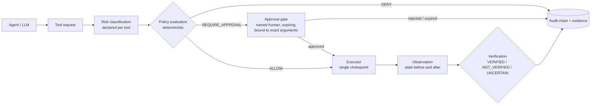

# ai-automation-harness

[](https://github.com/ericovirgy/ai-automation-harness/actions/workflows/ci.yml)


## What it is

A small, dependency-light reference implementation of a security and reliability harness for
AI and agentic automation. Every tool request is classified by risk, evaluated against a
deny-by-default policy, gated by explicit human approval when needed, executed through a single
chokepoint, **verified against observable state**, and recorded in a hash-chained audit log with an
evidence record. It runs offline, needs no model, and all tools are simulated.

## Why it exists

Agents and automations increasingly hold tools with external side effects: sending mail, changing
records, deleting data. Producing a plausible answer is the easy part. The hard part is
constraining what may run, observing what did run, and checking that what the tool *claims* it did is
what actually happened. A tool returning `success` is a claim, not evidence.

This repository demonstrates those controls as executable code with an adversarial test suite, not
as a policy essay. It explores patterns common in agentic systems: least privilege, fail-closed
defaults, approval gates, verification before completion, and evidence over claims.

## Try it in 60 seconds

```bash
python3.12 -m venv .venv && . .venv/bin/activate    # fish: source .venv/bin/activate.fish
pip install -e ".[dev]"

ai-automation-harness tools
ai-automation-harness simulate --policy examples/policy.yaml --scenarios examples/scenarios.json \
  --audit-out out/audit.jsonl --evidence-dir out/evidence
ai-automation-harness audit verify out/audit.jsonl
```

`simulate` runs 20 deterministic scenarios and prints what happened to each:

```text
    scenario                        decision          outcome                 verification  decision_reason
-------------------------------------------------------------------------------------------------------
ok  read_account                    ALLOW             COMPLETED               VERIFIED      allowed_by_policy
ok  read_file_path_traversal        DENY              DENIED                  NOT_RUN       argument_not_allowlisted
ok  draft_approved                  REQUIRE_APPROVAL  COMPLETED               VERIFIED      approval_required_risk_above_auto_threshold
ok  draft_rejected                  REQUIRE_APPROVAL  REJECTED                NOT_RUN       approval_required_risk_above_auto_threshold
ok  draft_approval_expired          REQUIRE_APPROVAL  EXPIRED                 NOT_RUN       approval_required_risk_above_auto_threshold
ok  send_email_default_deny         DENY              DENIED                  NOT_RUN       tool_not_in_allowed_tools
ok  delete_file_default_deny        DENY              DENIED                  NOT_RUN       tool_denied_by_policy
ok  unknown_tool                    DENY              DENIED                  NOT_RUN       unknown_tool
ok  draft_silent_drop               REQUIRE_APPROVAL  EXECUTED_NOT_VERIFIED   NOT_VERIFIED  approval_required_risk_above_auto_threshold
ok  draft_observer_down             REQUIRE_APPROVAL  EXECUTED_UNCERTAIN      UNCERTAIN     approval_required_risk_above_auto_threshold
... (20 rows in total)
20/20 scenarios matched their expected outcome
```

(Excerpt. Run the command for the full table.) The last two rows are the point of the project:
the tool reported success, yet the outcome is not `COMPLETED`.

## Architecture



Details, module map, decision order and failure semantics: [docs/architecture.md](docs/architecture.md).
Threats mapped to controls and tests: [docs/threat-model.md](docs/threat-model.md).

## Security model

| Control | What it means here |
| --- | --- |
| Deny by default | Unknown tools, actions and scopes are denied. A tool runs only if the policy lists it in `allowed_tools`. `denied_tools` always wins. There is no "default allow" switch: writing one is a policy error. |
| Risk classification | Risk (`read`, `low`, `medium`, `high`, `critical`) is declared per tool and validated for consistency. It is not inferred from the model's wording. |
| Scoped tools | Scopes are exact strings. A scope must be declared by the tool and explicitly granted to that tool by the policy. No wildcards. |
| Approvals | Explicit, by a named identity other than the requester. States: pending, approved, rejected, expired. Single use (atomic under concurrency), bound to the exact tool, scope, requester and arguments, expiring. High-risk, external and critical actions always need one; a policy can add approvals but cannot remove them. |
| Verification | After execution the harness reads state back and applies per-tool checks. Only `VERIFIED` yields `COMPLETED`. `UNCERTAIN` is its own result and never collapses into success or failure. |
| Evidence | Every stage emits an audit event carrying the full request state, chained by hash (optionally HMAC). Each request also gets a redacted evidence record bound to the log by digest. Secrets are redacted before anything is written. |

## Example: one request end to end

`send_email` (risk `high`, external side effect) under `examples/policy-email-enabled.yaml`, with a
downstream that silently drops the message. The request, as the agent sends it:

```json
{"request_id": "e04", "tool": "send_email", "action": "send", "scope": "email:send",
 "arguments": {"to": "alice@example.org", "subject": "Q3 summary", "body": "Final body"}}
```

**Policy decision** (also available as `ai-automation-harness evaluate ... --json`):

```json
{"decision": "REQUIRE_APPROVAL", "tool": "send_email", "action": "send", "scope": "email:send",
 "risk": "high", "reason_code": "approval_required_by_tool_declaration",
 "reason": "Tool declaration requires approval", "details": {}}
```

**Pipeline**, one audit event per stage (each event carries all fields; abbreviated here):

| seq | event | approval | execution | verification | outcome |
| --- | --- | --- | --- | --- | --- |
| 0 | `policy.decision` | NOT_REQUIRED | NOT_EXECUTED | NOT_RUN | IN_PROGRESS |
| 1 | `approval.requested` | PENDING | NOT_EXECUTED | NOT_RUN | PENDING_APPROVAL |
| 2 | `approval.approved` (by `security-reviewer`) | APPROVED | NOT_EXECUTED | NOT_RUN | IN_PROGRESS |
| 3 | `execution.finished` | APPROVED | SUCCEEDED | NOT_RUN | IN_PROGRESS |
| 4 | `verification.finished` | APPROVED | SUCCEEDED | **NOT_VERIFIED** | IN_PROGRESS |
| 5 | `request.finished` | APPROVED | SUCCEEDED | NOT_VERIFIED | **EXECUTED_NOT_VERIFIED** |

**Verification** (from the evidence record): the tool said `status: queued`, but

```json
[{"name": "output_schema",             "status": "VERIFIED"},
 {"name": "message_in_outbox",         "status": "NOT_VERIFIED", "detail": "expected state is absent"},
 {"name": "exactly_one_message_queued","status": "NOT_VERIFIED", "detail": "invariant violated"},
 {"name": "evidence_exists",           "status": "NOT_VERIFIED", "detail": "referenced evidence not found"}]
```

Execution succeeded; the outcome was not verified, and the record says so. Reproduce it with:

```bash
ai-automation-harness simulate --policy examples/policy-email-enabled.yaml \
  --scenarios examples/scenarios-email-enabled.json --evidence-dir out/evidence-email
cat out/evidence-email/ev-e04.json
```

## How a policy changes behaviour

The same request, two policies. `policy.yaml` does not list `send_email`; `policy-email-enabled.yaml`
adds it, limited to one recipient domain:

```yaml
# examples/policy-email-enabled.yaml (excerpt)
allowed_scopes: [accounts:read, records:read, files:read, drafts:write, email:send]
allowed_tools:
  send_email:
    scopes: [email:send]
    argument_allowlists:
      to: ["*@example.org"]
denied_tools: [delete_file]
risk: {max_auto_risk: low, max_risk: high}
```

```console
$ ai-automation-harness evaluate --policy examples/policy.yaml \
    --tool send_email --action send --scope email:send \
    --args '{"to": "a@example.org", "subject": "hi", "body": "b"}'
decision  DENY
tool      send_email (action: send, scope: email:send)
risk      high
reason    tool_not_in_allowed_tools: Tool is not in allowed_tools (deny by default)
policy    sha256:6f7b0fc6108c2a38
# exit code 20

$ ai-automation-harness evaluate --policy examples/policy-email-enabled.yaml ...same arguments...
decision  REQUIRE_APPROVAL
tool      send_email (action: send, scope: email:send)
risk      high
reason    approval_required_by_tool_declaration: Tool declaration requires approval
policy    sha256:a8d65e97a08acb15
# exit code 10
```

Enabling the tool does not make it automatic: sending still requires a human. A recipient outside
`example.org` is denied by the allowlist, and `delete_file` stays denied under both policies.
Policies are strict: unknown keys, duplicate keys, YAML aliases, a tool that is both allowed and
denied, scopes outside `allowed_scopes`, or references to undeclared tools all stop the harness from
starting.

Reference decisions (`tests/test_policy.py`):

| Tool | Risk | Decision under `policy.yaml` |
| --- | --- | --- |
| `read_account` | read | `ALLOW` |
| `create_draft` | medium | `REQUIRE_APPROVAL` |
| `send_email` | high | `DENY` (needs an explicit policy entry and then still approval) |
| `delete_file` | critical | `DENY` |
| `unknown_tool` | none | `DENY` (fail closed) |

## Threat scenarios covered by the tests

| Scenario | Expected behaviour |
| --- | --- |
| Unknown tool, undeclared action, excessive scope | Denied |
| Write attempted through a read-only tool | Denied by declaration, no writer handed out, invariant catches a handler that mutates anyway |
| High-risk action without approval | Waits, never executes |
| Expired, rejected, reused, self-granted or argument-mismatched approval | Never executes |
| Malformed request, replayed request id | Denied and audited, not raised |
| Malformed or ambiguous policy (duplicate keys, aliases, default-allow attempt) | Harness refuses to start |
| Valid-looking request outside an allowlist, path traversal | Denied |
| Instruction injected through tool output triggers `delete_file` | Denied by the same policy |
| Registry bypass (late registration, direct handler access) | Registry sealed, executor is the only caller |
| Tool reports success, state is absent | `EXECUTED_NOT_VERIFIED` |
| State unreadable, evidence reference missing | `EXECUTED_UNCERTAIN` |
| Incomplete output, failure after partial writes | Not verified, partial effects flagged |
| Tampered, deleted or reordered audit events | Chain verification fails |
| Audit event with a mandatory field missing | Cannot be constructed or loaded |
| Secrets in arguments, outputs or errors | Redacted before logging |

A future change that adds a write method to the read-only client fails
`tests/test_read_only_guard.py`; `tests/test_harness.py::test_execution_success_is_not_verification_success`
demonstrates execution success without verification success; fail-closed behaviour is covered across
`tests/test_policy.py` and `tests/test_harness.py`.

## CLI

| Command | Purpose |
| --- | --- |
| `evaluate --policy P --tool T --action A --scope S [--args JSON] [--side-effect none\|internal\|external] [--json]` | Evaluate one request and print a decision |
| `simulate --policy P --scenarios F [--audit-out F.jsonl] [--evidence-dir D] [--json]` | Run scenarios end to end and export audit and evidence |
| `audit verify F.jsonl [--hmac-key-env VAR]` | Verify the hash chain of an exported log |
| `audit summary F.jsonl` | Counts of decisions, outcomes and verification statuses |
| `policy check --policy P` | Validate a policy against the demo registry |
| `tools` | List the declared demo tools with risk, side effects and scopes |

Exit codes: `evaluate` returns `0` ALLOW, `10` REQUIRE_APPROVAL, `20` DENY. `simulate` returns `1` if
any scenario did not match its expectation. Invalid policy, input or tampered logs return `2`.

## Using it as a library

```python
from pathlib import Path

from ai_automation_harness import Harness, Policy
from ai_automation_harness.tools.demo import build_demo_registry
from ai_automation_harness.world import SimulatedWorld

policy = Policy.load("examples/policy.yaml")
harness = Harness(build_demo_registry(), policy, SimulatedWorld())

pending = harness.submit(
    {
        "request_id": "demo-1",
        "tool": "create_draft",
        "action": "create",
        "scope": "drafts:write",
        "arguments": {"to": "alice@example.org", "subject": "Q3 summary", "body": "Draft body"},
        "requester": "report-agent",
    }
)
print(pending.decision.decision.value, pending.outcome.value)  # REQUIRE_APPROVAL PENDING_APPROVAL

harness.approve(pending.approval_id, "alice")  # named human, not the requester
final = harness.resume("demo-1")
print(final.outcome.value, final.verification_status.value)  # COMPLETED VERIFIED
harness.audit.verify()
```

This exact flow lives in `examples/library_usage.py` and is run by the test suite. The
`ai_automation_harness.adapters` package translates provider-style tool calls (a generic
`{"name", "arguments"}` shape, OpenAI-style JSON-string arguments, Anthropic-style `tool_use` blocks)
into harness requests. It is an integration boundary only: no provider SDK is imported or required.

## Testing

```bash
pytest --cov --cov-report=term-missing
ruff check . && ruff format --check .
mypy
```

Measured on the final suite (Python 3.12.3, Linux): **347 tests passed, 0 failed, 98.38% line and
branch coverage** (gate: 90%). `ruff check`, `ruff format --check` and `mypy --strict` are clean. The
suite is fully offline and deterministic (injected clock, simulated tools, no network).

## Design principles

* **Least privilege.** Tools get only declared scopes, actions and arguments, granted explicitly.
* **Fail closed.** Unknown, malformed, ambiguous or unverifiable input never silently permits an action.
* **Explicit approval.** Approval is named, expiring, single use and bound to exact arguments. There is no implicit approval.
* **Verification before completion.** Success is a claim until state is read back.
* **Uncertainty is first-class.** `UNCERTAIN` is a distinct result with its own outcome.
* **Evidence over claims.** Every stage is recorded, chained and redacted; evidence is bound to the log by digest.

## Project layout

```text
src/ai_automation_harness/   core package (policy, registry, approvals, execution, verification, audit)
  tools/demo.py              simulated demo tools and their verification checks
  adapters/                  provider-style tool call translation (no SDK needed)
examples/                    two policies, two scenario files, library usage
tests/                       adversarial test suite
docs/                        architecture and threat model
```

## Limitations

* This is a **reference implementation**, not a production authorization framework.
* All tools are **simulated** against an in-memory world. No real mail, network or filesystem is touched.
* Handlers run in the same Python process. Controls defend against mistakes and casual misuse, not
  against hostile code in the process.
* Approver identity is a string. Authenticating approvers, persisting approvals and audit state, and
  handler timeouts or resource limits are not implemented.
* The audit chain detects edits, deletions and reordering. Without an externally recorded head hash
  or a protected HMAC key it cannot detect tail truncation or a full rewrite.
* Redaction is pattern based and will not catch every secret. Audit and evidence records include
  tool arguments after redaction. A tool can mark an argument `sensitive` to mask it entirely (the
  demo mail tools do this for `body`); everything else is logged, so avoid placing sensitive content
  in arguments.
* One process, one lock: requests are serialised and nothing is persisted. Requester identity is
  supplied by the caller.
* Policies and verification checks need domain-specific review before use with a real system.
* No claim of regulatory compliance is made.

## License

MIT, see [LICENSE](LICENSE).
