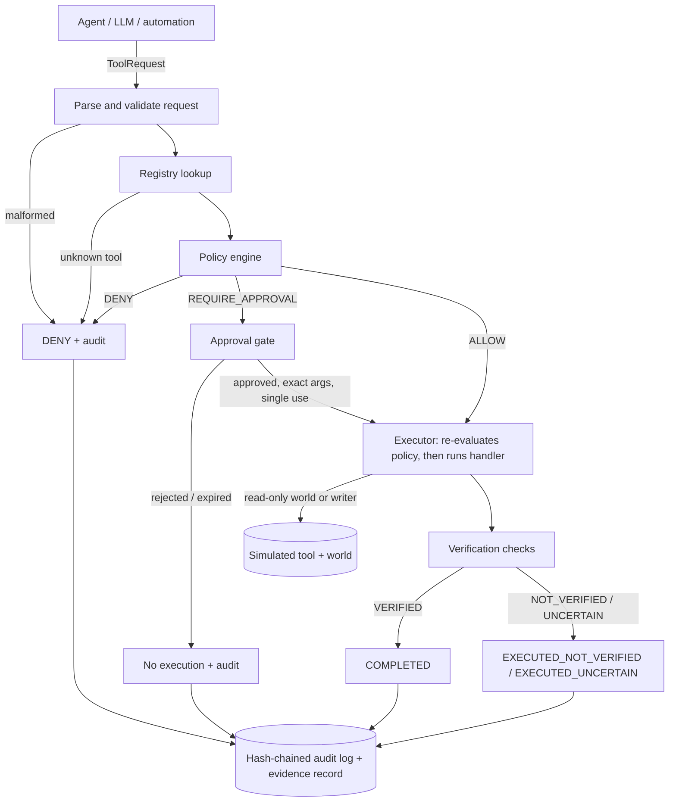

# Architecture

The harness sits between an agent (or any automation) and the tools it wants to use. It does
not trust the agent, and it does not trust a tool's "success" either.

## Components

| Module | Responsibility |
| --- | --- |
| `models.py` | Risk, decision, status and reason-code enums; `ToolRequest` (validated on construction); `PolicyDecision`. |
| `registry.py` | `ToolSpec` declarations and `ToolRegistry`. Validates declarations, seals on harness creation, never exposes handlers. |
| `policy.py` | Strict policy loader (rejects duplicate keys, aliases, unknown keys, ambiguity) and the deterministic `PolicyEngine`. |
| `approvals.py` | `ApprovalGate`: pending, approved, rejected, expired. Bound to exact arguments, single use, no self-approval. |
| `execution.py` | `Executor`: the only code path that calls a handler. Evaluates policy itself; callers cannot hand it a decision. |
| `verification.py` | Check strategies and the aggregation rule (VERIFIED / NOT_VERIFIED / UNCERTAIN). |
| `audit.py` | `AuditEvent` (all fields mandatory), hash-chained `AuditLog`, JSONL export and `verify_chain`. |
| `evidence.py` | One redacted, structured evidence record per request, bound to the audit log by digest. |
| `redaction.py` | Key-based and pattern-based secret redaction applied before anything is logged. |
| `harness.py` | Orchestration. Emits one audit event per stage, each snapshotting the full request state. |
| `world.py`, `tools/demo.py` | Simulated environment and demo tools (no real filesystem, network or mail). |
| `adapters/` | Provider-agnostic boundary: provider-style tool call to `ToolRequest`. No SDK required. |
| `scenarios.py`, `cli.py` | Deterministic scenario runner and the command line interface. |

## Risk model

Risk belongs to tools, not to the model. Each `ToolSpec` declares one level.

| Level | Meaning | Demo tool |
| --- | --- | --- |
| `read` | Single-object read, no side effects | `read_account`, `read_file` |
| `low` | Read-only but broader (queries, enumeration) | `search_records` |
| `medium` | Reversible change to internal state | `create_draft` |
| `high` | External side effect or hard-to-reverse disclosure | `send_email` |
| `critical` | Destructive or irreversible | `delete_file` |

Declarations are validated for consistency at registration (a tool without side effects cannot be
above `low`; external effects imply at least `high`; `high` and above must require approval).

## Decision order

`PolicyEngine.evaluate` checks, in this order, and returns the first matching denial:

1. tool is declared in the registry (`unknown_tool`)
2. action is declared for the tool (`undeclared_action`)
3. the caller's claimed side effect matches the declaration (`side_effect_mismatch`)
4. scope is declared by the tool (`scope_not_declared_by_tool`)
5. arguments satisfy the tool's argument specs (`invalid_arguments`)
6. tool is not in `denied_tools` (`tool_denied_by_policy`)
7. tool is in `allowed_tools` (`tool_not_in_allowed_tools`)
8. action is permitted by the policy rule (`action_not_permitted_by_policy`)
9. scope is granted to this tool by the policy (`scope_not_granted_by_policy`)
10. argument allowlists match, with traversal-style values rejected (`argument_not_allowlisted`)
11. risk is not above `max_risk` (`risk_above_policy_ceiling`)

Then approval is required if any of these hold (the policy can add triggers but cannot remove the
first three): the tool declares it, the side effect is external, the risk is critical, the risk is
above `max_auto_risk`, or the policy rule says `approval: required`. Otherwise the result is `ALLOW`.

## Request lifecycle and outcomes

| Outcome | Meaning |
| --- | --- |
| `DENIED` | Policy denied it, or the request was malformed or replayed. Nothing ran. |
| `PENDING_APPROVAL` | Waiting for a named human. Nothing ran. |
| `REJECTED` / `EXPIRED` | The approval was refused or lapsed. Nothing ran. |
| `EXECUTION_FAILED` | The handler raised or returned a non-mapping. If state changed anyway this is flagged `partial_effects_detected`. |
| `EXECUTED_NOT_VERIFIED` | The tool reported success but at least one check contradicted the claim. |
| `EXECUTED_UNCERTAIN` | The claim could not be confirmed or refuted (unreadable state, missing evidence reference, no checks). |
| `COMPLETED` | Execution succeeded **and** every check verified. The only success state. |

## Verification

Every tool registers checks next to its handler. Strategies in `verification.py`:

* `output_schema`: required fields and types
* `expected_state`: read the state back from the environment and compare with the claim
* `invariant`: a condition that must hold afterwards (for example exactly one message queued)
* `evidence_exists`: the output must reference evidence and the evidence must resolve
* `state_unchanged`: added automatically for tools declared without side effects

Aggregation: any `NOT_VERIFIED` wins, then any `UNCERTAIN`, otherwise `VERIFIED`. A check that
raises is `UNCERTAIN`. No checks at all is `UNCERTAIN`, never `VERIFIED`. `NOT_RUN` is a distinct
audit value for "verification did not apply" and is never a pass.

## Audit and evidence

Each stage appends an `AuditEvent` carrying the complete request state, so no event can omit the
decision, approval, execution or verification fields:

`seq, timestamp, request_id, event_type, tool, action, risk, scope, policy_decision, reason_code,
reason, approval_status, execution_status, verification_status, outcome, evidence_ref,
evidence_digest, arguments (redacted), prev_hash, hash`

`hash = SHA-256(canonical JSON of the event with prev_hash)`, or HMAC-SHA-256 when a key is given.
The final event of a request carries the digest of its evidence record. Verification detects edits,
deletions and reordering. It cannot detect truncation of the tail or a full rewrite unless the head
hash is anchored somewhere the attacker cannot write (or an HMAC key is used and kept secret).

## Failure semantics

| Situation | Behaviour |
| --- | --- |
| Concurrent resume of one approved request | Serialised; the approval is spent once |
| Malformed request | Denied and audited with a reason; never raised to the caller |
| Unknown tool / action / scope | Denied |
| Malformed, ambiguous or registry-inconsistent policy | Harness refuses to start (`MalformedPolicyError`) |
| Tool declaration inconsistent | Registration fails (`ToolDeclarationError`) |
| Policy would deny at resume time | Denied even if an approval exists |
| Approval pending, rejected, expired, reused or for different arguments | Not executed |
| Handler raises | `EXECUTION_FAILED`, error text redacted, partial effects flagged |
| Verification check raises or state unreadable | `UNCERTAIN`, not `COMPLETED` |
